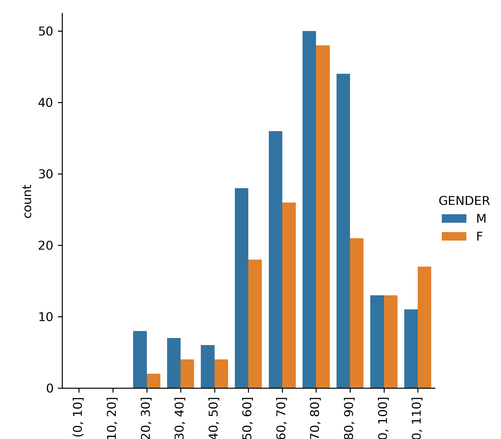
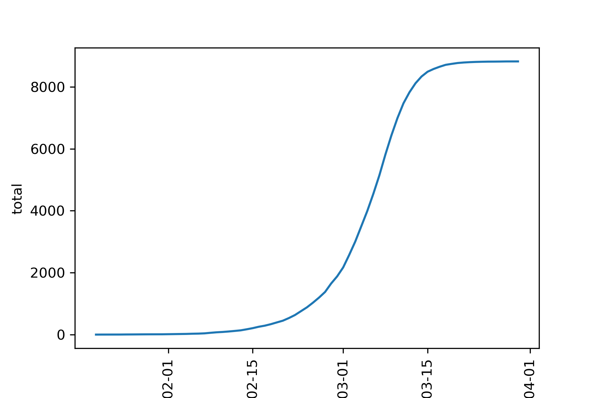
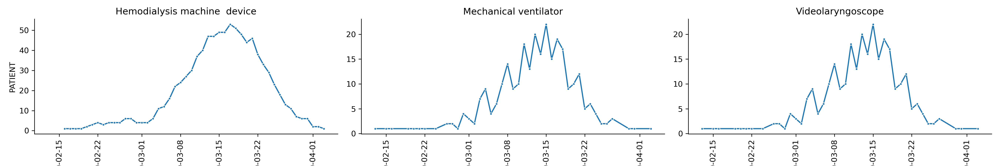

# covid-19_FHIR_EMR_data_analysis

Synethic Covid-19 FHIR/EMR data 
## Lab values for COVID-19 patients

## Lab values part 2 for COVID-19 patients

## A plot of deaths grouped by age range and gender.

<!--  -->
## Small multiples plot of supply usage over time.

## Total cases over time

## number of devices used to treat COVID-19 over time

Sythea dataset... Will do a deeper analysis later 